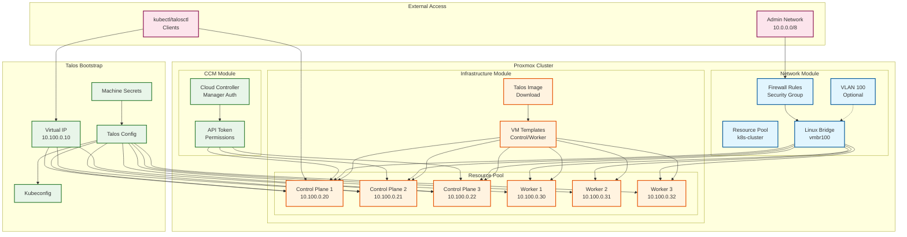
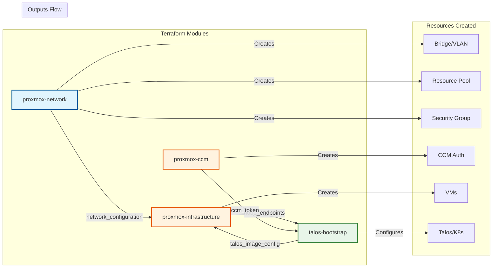

# proxmox-talos-terraform

Automated deployment of Talos Linux Kubernetes clusters on Proxmox Virtual Environment using Terraform/OpenTofu.

## Features

- **Modular Architecture**: Clean separation of concerns with focused modules
- **VPC-like Networking**: Create isolated networks with Linux bridges, VLANs, and firewall rules
- **Grouped Configuration**: Organized variable structure for better maintainability
- **High Availability**: Support for multiple control plane nodes with Virtual IP
- **Cloud Controller Manager**: Integrated Proxmox CCM for cloud-native features
- **GitOps Ready**: Pre-configured with Flux CD manifests
- **Monitoring Stack**: Prometheus Operator CRDs included
- **Multi-Node Support**: Distribute VMs across multiple Proxmox nodes
- **Resource Organization**: Automatic resource pool creation for cluster management

## Architecture

This project uses a modular Terraform architecture with four main components:

1. **proxmox-network**: Creates VPC-like isolated networks, VLANs, and resource pools
1. **proxmox-ccm**: Manages Proxmox Cloud Controller Manager authentication
1. **talos-bootstrap**: Handles Talos configuration and cluster bootstrapping
1. **proxmox-infrastructure**: Creates VM templates and instances

### High-Level Architecture



### Module Relationships



## Prerequisites

- Proxmox VE 7.0+ with API access
- Terraform 1.0+ or OpenTofu
- Sufficient resources for your desired cluster size

## Getting Started

### 1. Configuration

Copy the example configuration and customize it:

```bash
cp terraform.tfvars.example terraform.tfvars
```

Edit `terraform.tfvars` with your settings. The configuration is organized into logical groups:

```hcl
# Proxmox connection and infrastructure
proxmox_config = {
  endpoint  = "https://192.168.100.1:8006/"
  api_token = "user@pve!token=your-token-here"
  insecure  = true

  # Optional: Override default values
  node_name                     = "pve"
  talos_disk_image_datastore_id = "local"
  template_datastore_id         = "local-lvm"
  vm_datastore_id               = "local-lvm"
  dns_servers                   = ["1.1.1.1", "8.8.8.8"]

  # SSH configuration for automatic routing setup (optional)
  # ssh_user        = "root"
  # ssh_password    = "your-password"
  # ssh_private_key = "~/.ssh/id_rsa"  # Recommended

  # Cloud Controller Manager configuration
  ccm_config = {
    enabled = true
  }
}

# Network configuration
network_config = {
  cidr      = "192.168.100.0/24"
  gateway   = "192.168.100.1"
  bridge    = "vmbr0"
  interface = "eth0"

  # Optional: Create isolated VPC-like network
  create_bridge = true
  bridge_name   = "vmbr100"  # Or use bridge_id for auto-naming
  bridge_cidr   = "192.168.100.1/24"  # Bridge interface IP
  vlan_id       = 100  # Optional: Create VLAN

  # NAT Gateway for internet access
  enable_nat_gateway = true  # Auto-configure routing (requires SSH)

  # Firewall configuration
  enable_firewall = true
  allowed_cidrs   = ["10.0.0.0/8", "192.168.0.0/16"]
}

# Cluster configuration
cluster_config = {
  name          = "talos-cluster"
  talos_version = "v1.10.5"

  # Virtual IP for HA control plane
  vip = {
    enabled = true
    ip      = "192.168.100.100"
  }
}

# Node configuration
node_config = {
  controlplane_count    = 3  # Must be odd number for etcd quorum
  worker_count          = 3
  controlplane_ip_start = 10  # First control plane: 192.168.100.10
  worker_ip_start       = 20  # First worker: 192.168.100.20
}
```

### 2. Initialize and Deploy

```bash
# Initialize Terraform/OpenTofu
tofu init

# Review the deployment plan
tofu plan -out=tfplan

# Deploy the infrastructure
tofu apply tfplan
```

### 3. Access Your Cluster

After deployment, export the configurations:

```bash
# Export Talos client configuration
tofu output -raw talos_client_configuration > ~/.talos/config

# Export Kubernetes configuration
tofu output -raw talos_cluster_kubeconfig > ~/.kube/talos_config

# Set the kubeconfig
export KUBECONFIG=~/.kube/talos_config

# Verify cluster access
kubectl get nodes
kubectl get pods -A
```

## Configuration Reference

### Variable Groups

The configuration uses grouped variables for better organization:

#### `proxmox_config`

- Connection settings (endpoint, API token)
- Storage locations for images and VMs
- DNS servers
- Cloud Controller Manager settings

#### `network_config`

- CIDR and gateway configuration
- Network bridge selection
- Network interface naming

#### `cluster_config`

- Cluster name and Talos version
- Virtual IP configuration for HA
- Custom endpoint override options

#### `node_config`

- Number of control plane and worker nodes
- IP address allocation settings

#### Additional Configuration

- `node_distribution`: Distribute VMs across multiple Proxmox nodes
- `template_config`: VM template IDs
- `resource_config`: CPU, memory, and disk allocations
- `vm_id_ranges`: ID ranges for different node types
- `tagging_config`: Resource tagging strategy

## Advanced Features

### VPC-like Isolated Networking

Create an isolated network environment similar to AWS VPC for your Talos cluster:

```hcl
network_config = {
  # Basic network settings
  cidr      = "10.100.0.0/24"
  gateway   = "10.100.0.1"
  interface = "eth0"

  # Create a new isolated Linux bridge
  create_bridge = true
  bridge_name   = "vmbr100"        # Custom bridge name
  bridge_cidr   = "10.100.0.1/24"  # IP address for the bridge interface
  bridge_ports  = []               # Empty = fully isolated (recommended)
  # bridge_ports = ["eth1"]        # Bridge to physical interface (optional)

  # Enable NAT gateway for internet access
  enable_nat_gateway = true        # Requires SSH configuration

  # VLAN configuration (optional)
  vlan_id               = 100
  vlan_parent_interface = "eth0"

  # Resource pool for organization
  resource_pool_id = "talos-prod"  # Defaults to cluster name if not specified

  # Firewall rules
  enable_firewall = true
  allowed_cidrs   = [
    "10.0.0.0/8",      # Internal networks
    "192.168.0.0/16",  # Local networks
    "203.0.113.0/24"   # Specific external access
  ]
  nodeport_range = "30000-32767"
}
```

This creates:

- **Isolated Linux Bridge**: A dedicated network bridge for your cluster
- **VLAN Segmentation**: Optional VLAN tagging for additional isolation
- **Resource Pool**: Groups all cluster resources for easier management
- **Firewall Rules**: Automatic security group with Kubernetes-specific ports

The firewall automatically configures:

- Kubernetes API access (port 6443)
- Talos API access (port 50000)
- Inter-node communication
- NodePort services (customizable range)

#### NAT Gateway Configuration

By default, isolated networks have no internet access. To enable outbound connectivity, you have two options:

**Option 1: Automatic NAT Gateway** (Recommended)

```hcl
network_config = {
  # ... other settings ...

  # Enable automatic routing configuration
  enable_nat_gateway = true
}

# Also configure SSH access in proxmox_config
proxmox_config = {
  # ... other settings ...

  # SSH authentication (choose one)
  ssh_user        = "root"
  ssh_private_key = "~/.ssh/id_rsa"  # Recommended
  # OR
  ssh_password    = "your-password"
}
```

This will automatically:

1. Add routing on the Proxmox host after bridge creation
1. Make the route persistent in `/etc/network/interfaces`
1. Enable access from Proxmox host to the cluster network

**Option 2: Manual NAT Configuration**

If you prefer manual setup or don't want to provide SSH credentials:

1. **Enable NAT on Proxmox host**:

   ```bash
   # Enable IP forwarding
   echo 1 > /proc/sys/net/ipv4/ip_forward
   echo "net.ipv4.ip_forward=1" >> /etc/sysctl.conf

   # Add NAT masquerading
   iptables -t nat -A POSTROUTING -s 10.0.0.0/16 -o vmbr0 -j MASQUERADE

   # Save iptables rules
   apt-get install iptables-persistent
   netfilter-persistent save
   ```

1. **Add route for cluster access**:

   ```bash
   # Add route (after bridge exists)
   ip route add 10.0.0.0/16 dev vmbr100

   # Make persistent
   echo "up ip route add 10.0.0.0/16 dev vmbr100" >> /etc/network/interfaces
   ```

### Multi-Node Proxmox Clusters

Distribute your Kubernetes nodes across multiple Proxmox hosts:

```hcl
node_distribution = {
  "pve1" = {
    controlplane_count = 1
    worker_count       = 2
  }
  "pve2" = {
    controlplane_count = 1
    worker_count       = 2
  }
  "pve3" = {
    controlplane_count = 1
    worker_count       = 2
  }
}
```

### Resource Customization

Adjust resources per node type:

```hcl
resource_config = {
  controlplane = {
    memory    = 4096
    cpu_cores = 4
    disk_size = 20
  }
  worker = {
    memory    = 16384
    cpu_cores = 8
    disk_size = 100
  }
  cpu_type = "host"  # Use host CPU type for better performance
}
```

### Disable Virtual IP

For single control plane deployments or when using external load balancers:

```hcl
cluster_config = {
  name = "talos-cluster"
  vip = {
    enabled = false
  }
  endpoint_override = "https://external-lb.example.com:6443"
}
```

## Outputs

Key outputs available after deployment:

- `cluster_endpoint`: Kubernetes API endpoint
- `controlplane_nodes`: Control plane node details
- `worker_nodes`: Worker node details
- `talos_client_configuration`: Talos configuration for talosctl
- `talos_cluster_kubeconfig`: Kubernetes configuration
- `resource_pool_id`: Resource pool ID for the cluster
- `network_bridge`: Network bridge used for the cluster
- `vlan_id`: VLAN ID if configured
- `security_group_name`: Firewall security group name

## Documentation

This project uses [terraform-docs](https://github.com/terraform-docs/terraform-docs) to generate documentation automatically.

<!-- BEGIN_TF_DOCS -->
### Requirements

| Name | Version |
|------|---------|
| <a name="requirement_terraform"></a> [terraform](#requirement\_terraform) | >= 1.0 |
| <a name="requirement_proxmox"></a> [proxmox](#requirement\_proxmox) | 0.79.0 |
| <a name="requirement_random"></a> [random](#requirement\_random) | ~> 3.1 |
| <a name="requirement_talos"></a> [talos](#requirement\_talos) | 0.8.1 |

### Providers

No providers.

### Modules

| Name | Source | Version |
|------|--------|---------|
| <a name="module_proxmox_ccm"></a> [proxmox\_ccm](#module\_proxmox\_ccm) | ./modules/proxmox-ccm | n/a |
| <a name="module_proxmox_infrastructure"></a> [proxmox\_infrastructure](#module\_proxmox\_infrastructure) | ./modules/proxmox-infrastructure | n/a |
| <a name="module_proxmox_network"></a> [proxmox\_network](#module\_proxmox\_network) | ./modules/proxmox-network | n/a |
| <a name="module_talos_bootstrap"></a> [talos\_bootstrap](#module\_talos\_bootstrap) | ./modules/talos-bootstrap | n/a |

### Resources

No resources.

### Inputs

| Name | Description | Type | Default | Required |
|------|-------------|------|---------|:--------:|
| <a name="input_cluster_config"></a> [cluster\_config](#input\_cluster\_config) | Cluster configuration settings | <pre>object({<br/>    name          = string<br/>    talos_version = optional(string, "v1.10.5") # renovate: datasource=github-releases depName=siderolabs/talos<br/>    vip = optional(object({<br/>      enabled = bool<br/>      ip      = optional(string)<br/>      }), {<br/>      enabled = true<br/>      ip      = null<br/>    })<br/>    endpoint_override = optional(string)<br/>  })</pre> | n/a | yes |
| <a name="input_network_config"></a> [network\_config](#input\_network\_config) | Network configuration for Talos nodes | <pre>object({<br/>    enable_dhcp = optional(bool, false)<br/>    cidr        = string<br/>    gateway     = string<br/>    bridge      = optional(string, "vmbr0")<br/>    interface   = optional(string, "eth0")<br/><br/>    # VPC-like network settings<br/>    create_bridge = optional(bool, false)  # Create a new Linux bridge<br/>    bridge_name   = optional(string)       # Custom bridge name (auto-generated if not specified)<br/>    bridge_id     = optional(number, 100)  # Bridge ID if bridge_name not specified<br/>    bridge_cidr   = optional(string)       # CIDR for the bridge interface<br/>    bridge_ports  = optional(list(string)) # Physical interfaces to bridge<br/>    vlan_aware    = optional(bool, true)<br/><br/>    # VLAN configuration<br/>    vlan_id               = optional(number) # Create VLAN if specified<br/>    vlan_parent_interface = optional(string, "eth0")<br/><br/>    # Resource pool<br/>    resource_pool_id = optional(string) # Defaults to cluster name<br/><br/>    # Network settings<br/>    mtu = optional(number, 1500)<br/><br/>    # Firewall configuration<br/>    enable_firewall = optional(bool, false)<br/>    allowed_cidrs   = optional(list(string), ["0.0.0.0/0"])<br/>    nodeport_range  = optional(string, "30000-32767")<br/><br/>    # NAT Gateway configuration<br/>    enable_nat_gateway = optional(bool, false) # Auto-configure routing for NAT<br/>  })</pre> | n/a | yes |
| <a name="input_node_config"></a> [node\_config](#input\_node\_config) | Node configuration for the cluster | <pre>object({<br/>    controlplane_count    = number<br/>    worker_count          = number<br/>    controlplane_ip_start = optional(number, 10)<br/>    worker_ip_start       = optional(number, 20)<br/>  })</pre> | <pre>{<br/>  "controlplane_count": 3,<br/>  "worker_count": 3<br/>}</pre> | no |
| <a name="input_node_distribution"></a> [node\_distribution](#input\_node\_distribution) | Distribution of VMs across Proxmox nodes | <pre>map(object({<br/>    controlplane_count = number<br/>    worker_count       = number<br/>  }))</pre> | <pre>{<br/>  "pve": {<br/>    "controlplane_count": 3,<br/>    "worker_count": 3<br/>  }<br/>}</pre> | no |
| <a name="input_proxmox_config"></a> [proxmox\_config](#input\_proxmox\_config) | Proxmox connection and infrastructure configuration | <pre>object({<br/>    endpoint  = string<br/>    api_token = string<br/>    insecure  = optional(bool, false)<br/><br/>    node_name                     = optional(string, "pve")<br/>    talos_disk_image_datastore_id = optional(string, "local")<br/>    template_datastore_id         = optional(string, "local-lvm")<br/>    vm_datastore_id               = optional(string, "local-lvm")<br/><br/>    dns_servers = optional(list(string), ["1.1.1.1", "8.8.8.8"])<br/><br/>    # SSH configuration for routing setup (optional)<br/>    ssh_host        = optional(string) # Defaults to endpoint host<br/>    ssh_user        = optional(string, "root")<br/>    ssh_password    = optional(string)<br/>    ssh_private_key = optional(string) # Path to SSH private key<br/><br/>    ccm_config = optional(object({<br/>      enabled    = bool<br/>      user       = optional(string, "talos-ccm@pve")<br/>      role       = optional(string, "TalosCCM")<br/>      token_name = optional(string, "ccm-token")<br/>      privileges = optional(list(string), ["VM.Audit"])<br/>      }), {<br/>      enabled    = true<br/>      user       = "talos-ccm@pve"<br/>      role       = "TalosCCM"<br/>      token_name = "ccm-token"<br/>      privileges = ["VM.Audit"]<br/>    })<br/>  })</pre> | n/a | yes |
| <a name="input_resource_config"></a> [resource\_config](#input\_resource\_config) | VM resource allocation configuration | <pre>object({<br/>    controlplane = optional(object({<br/>      memory    = optional(number, 4096)<br/>      cpu_cores = optional(number, 4)<br/>      disk_size = optional(number, 20)<br/>    }), {})<br/>    worker = optional(object({<br/>      memory    = optional(number, 8192)<br/>      cpu_cores = optional(number, 8)<br/>      disk_size = optional(number, 50)<br/>    }), {})<br/>    cpu_type = optional(string, "x86-64-v2-AES")<br/>  })</pre> | `{}` | no |
| <a name="input_tagging_config"></a> [tagging\_config](#input\_tagging\_config) | Tagging configuration for resources | <pre>object({<br/>    common = optional(list(string), ["talos", "terraform"])<br/>    extra  = optional(list(string), [])<br/>  })</pre> | <pre>{<br/>  "common": [<br/>    "talos",<br/>    "terraform"<br/>  ],<br/>  "extra": []<br/>}</pre> | no |
| <a name="input_template_config"></a> [template\_config](#input\_template\_config) | VM template configuration | <pre>object({<br/>    controlplane_id = optional(number, 998)<br/>    worker_id       = optional(number, 999)<br/>    node            = optional(string, "pve")<br/>  })</pre> | `{}` | no |
| <a name="input_vm_id_ranges"></a> [vm\_id\_ranges](#input\_vm\_id\_ranges) | VM ID ranges for different node types | <pre>object({<br/>    controlplane_min = optional(number, 2000)<br/>    controlplane_max = optional(number, 2999)<br/>    worker_min       = optional(number, 3000)<br/>    worker_max       = optional(number, 3999)<br/>  })</pre> | `{}` | no |

### Outputs

| Name | Description |
|------|-------------|
| <a name="output_cluster_endpoint"></a> [cluster\_endpoint](#output\_cluster\_endpoint) | Cluster endpoint URL |
| <a name="output_controlplane_ips"></a> [controlplane\_ips](#output\_controlplane\_ips) | List of control plane IP addresses |
| <a name="output_controlplane_nodes"></a> [controlplane\_nodes](#output\_controlplane\_nodes) | Control plane node information |
| <a name="output_controlplane_template_id"></a> [controlplane\_template\_id](#output\_controlplane\_template\_id) | Control plane template VM ID |
| <a name="output_network_bridge"></a> [network\_bridge](#output\_network\_bridge) | Network bridge used for the cluster |
| <a name="output_proxmox_ccm_token"></a> [proxmox\_ccm\_token](#output\_proxmox\_ccm\_token) | Proxmox Cloud Controller Manager API token |
| <a name="output_resource_pool_id"></a> [resource\_pool\_id](#output\_resource\_pool\_id) | Resource pool ID for the cluster |
| <a name="output_security_group_name"></a> [security\_group\_name](#output\_security\_group\_name) | Firewall security group name if configured |
| <a name="output_talos_client_configuration"></a> [talos\_client\_configuration](#output\_talos\_client\_configuration) | Complete Talos client configuration for ~/.talos/config |
| <a name="output_talos_cluster_kubeconfig"></a> [talos\_cluster\_kubeconfig](#output\_talos\_cluster\_kubeconfig) | Talos cluster kubeconfig |
| <a name="output_talos_image_id"></a> [talos\_image\_id](#output\_talos\_image\_id) | Talos image ID in Proxmox |
| <a name="output_talos_machine_secrets"></a> [talos\_machine\_secrets](#output\_talos\_machine\_secrets) | Talos machine secrets (sensitive) |
| <a name="output_vlan_id"></a> [vlan\_id](#output\_vlan\_id) | VLAN ID if configured |
| <a name="output_worker_ips"></a> [worker\_ips](#output\_worker\_ips) | List of worker IP addresses |
| <a name="output_worker_nodes"></a> [worker\_nodes](#output\_worker\_nodes) | Worker node information |
| <a name="output_worker_template_id"></a> [worker\_template\_id](#output\_worker\_template\_id) | Worker template VM ID |
<!-- END_TF_DOCS -->
